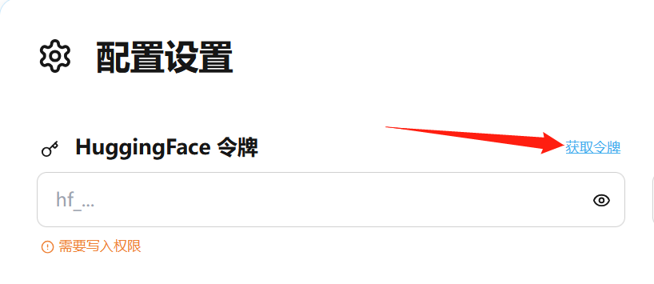
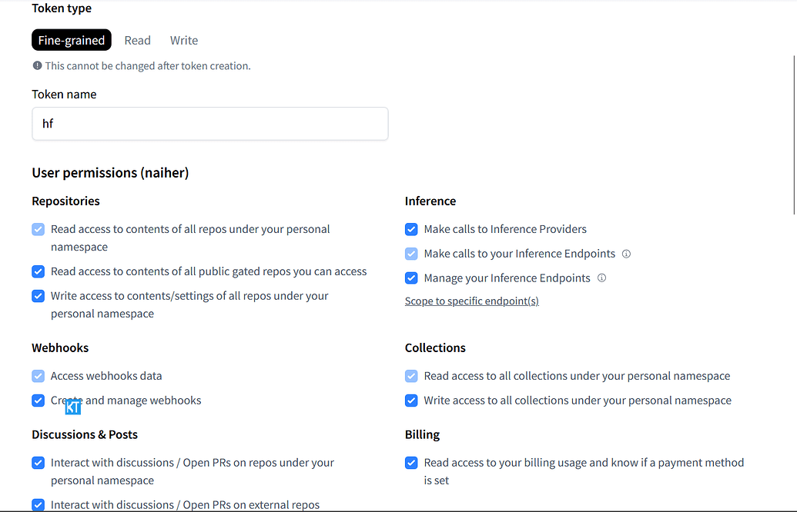

# 🚀 HuggingFace Space 一键部署器

> 将您的 Git 代码一键部署到 HuggingFace Spaces，无需繁琐配置！

[](LICENSE)
[](https://www.python.org)
[](https://fastapi.tiangolo.com)

## 🎯 为什么选择这个工具？

在 HuggingFace Spaces 上部署应用通常需要：
- ✗ 手动创建 Space
- ✗ 配置环境变量
- ✗ 上传代码文件
- ✗ 等待构建完成
- ✗ 处理各种错误

**使用这个工具，您只需要：**
- ✓ 填写一个简单表单
- ✓ 点击部署按钮
- ✓ 喝杯咖啡，等待完成！

## ⚡ 快速开始（3分钟部署）

### 1️⃣ 启动部署器

```bash
# 克隆并启动
git clone https://github.com/your-repo/huggingface-space-deployer.git
cd huggingface-space-deployer
pip install -r requirements.txt
python main.py
```

### 2️⃣ 访问界面

打开浏览器访问 `http://localhost:7860`

### 3️⃣ 一键部署

填写表单：
- **HF Token**: 从 [这里](https://huggingface.co/settings/tokens) 获取（需要写入权限）
- **Git 仓库**: 您要部署的 Git 仓库地址
- **Space 名称**: 给您的应用起个名字

点击 "🚀 开始部署"，搞定！

## ✨ 核心特性

### 🎨 优雅的界面
- 现代化 UI 设计，支持浅色/深色主题切换
- 实时部署进度展示
- 响应式设计，手机也能用

### 🛠️ 强大的功能
- **稀疏克隆**：支持部署仓库的子目录
- **环境变量**：安全管理敏感配置
- **私有 Space**：支持创建私有应用
- **错误处理**：友好的错误提示和解决方案

### 🔧 开发者友好
- RESTful API 接口
- 详细的部署日志
- 支持各种框架（Gradio、Streamlit、FastAPI 等）

## 📖 使用场景

### 场景 1：部署 Gradio 应用
```python
# 您的 app.py
import gradio as gr

def greet(name):
    return f"Hello {name}!"

demo = gr.Interface(fn=greet, inputs="text", outputs="text")
demo.launch(server_port=7860)
```

### 场景 2：部署子目录
如果您的应用在仓库的子目录中：
```
my-repo/
├── frontend/
├── backend/
└── demos/
    └── my-app/  # 只想部署这个
        ├── Dockerfile
        └── app.py
```

只需在 "部署路径" 填写 `demos/my-app`！

### 场景 3：使用环境变量
在环境变量区域添加：
```
API_KEY=sk-xxx
DATABASE_URL=redis://...
```

## 🔥 高级功能

### API 接口调用

```python
import requests

# 创建部署任务
response = requests.post(
    "http://localhost:7860/deploy",
    headers={"X-API-Key": "your_api_key"},
    json={
        "hf_token": "hf_...",
        "git_repo_url": "https://github.com/user/repo",
        "space_name": "my-awesome-app",
        "space_port": 7860,
        "env_vars": {"API_KEY": "xxx"}
    }
)

task_id = response.json()["task_id"]

# 查询部署状态
status = requests.get(f"http://localhost:7860/deploy/status/{task_id}")
print(status.json())
```

### Docker 支持

确保您的仓库包含 `Dockerfile`：

```dockerfile
FROM python:3.9

WORKDIR /app
COPY . .
RUN pip install -r requirements.txt

EXPOSE 7860
CMD ["python", "app.py"]
```

## 💡 常见问题

<details>
<summary><b>Q: 怎么获取 HuggingFace Token ？</b></summary>
					
A: 如下图点击`获取令牌` -> `Create new token` -> 如图2`复制token`   


</details>

<details>
<summary><b>Q: HuggingFace Token 需要什么权限？</b></summary>

A: 需要在 HuggingFace Settings 创建具有 **write** 权限的 token，参考如下图。

</details>

<details>
<summary><b>Q: 支持哪些框架？</b></summary>

A: 任何可以容器化的 Web 应用都支持，包括但不限于：
- Gradio
- Streamlit  
- FastAPI
- Flask
- Next.js
- Vue/React
</details>

<details>
<summary><b>Q: 部署失败怎么办？</b></summary>

A: 检查以下几点：
1. 确保仓库包含 `Dockerfile`
2. 确保应用监听正确的端口（默认 7860）
3. 查看部署日志中的错误信息
</details>

## 🛠️ 技术栈

- **后端**: FastAPI + Pydantic (类型安全)
- **前端**: HTMX + DaisyUI
- **部署**: HuggingFace Hub API
- **实时更新**: Server-Sent Events

## 📦 安装配置

<details>
<summary>点击展开详细配置</summary>

### 环境变量配置

创建 `.env` 文件：

```env
# API 保护（可选）
API_KEY=your_secret_key

# Redis 配置（必选，用于持久化任务状态）
REDIS_URL=redis://localhost:6379
```

### 依赖安装

```bash
# 使用 pip
pip install -r requirements.txt

# 或使用 poetry
poetry install
```

### 开发模式

```bash
# 开启热重载
uvicorn main:app --reload --port 7860
```

</details>

## 🤝 贡献指南

欢迎贡献！无论是：
- 🐛 报告 Bug
- 💡 提出新功能
- 📖 改进文档
- 🔧 提交代码

## 📄 许可证

本项目采用 GPL-3.0 许可证。

## 🌟 Star History

如果这个项目对您有帮助，请给个 Star ⭐️！

---

<p align="center">
  Made with ❤️ for the HuggingFace Community
</p>

<p align="center">
  <a href="https://huggingface.co/spaces">了解 HF Spaces</a> •
  <a href="https://github.com/your-repo/huggingface-space-deployer/issues">报告问题</a> •
  <a href="FRONTEND_GUIDE.md">前端文档</a>
</p>
